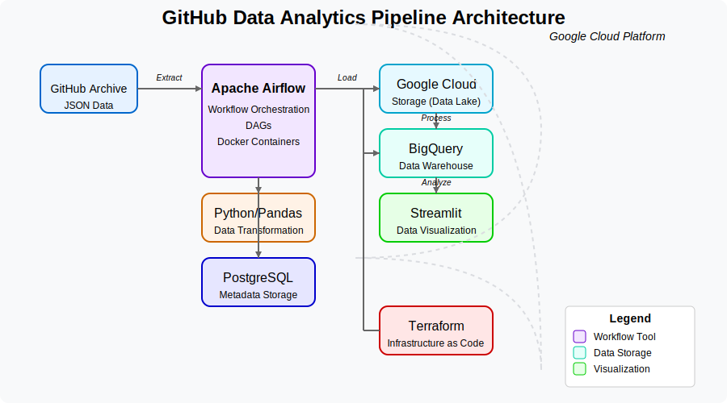

# GitHub Data Analytics Pipeline

## 1. Problem Description

This project aims to analyze GitHub repository activity by processing data from the GitHub Archive dataset. The primary goal is to extract, load, and analyze watch events from GitHub repositories to identify trending repositories, user engagement patterns, and activity distributions over time.

Key analytics include:
- Identification of the most popular repositories
- Analysis of user engagement patterns
- Temporal trends in GitHub activities

By processing GitHub Archive data, this pipeline enables data-driven insights into open-source project popularity and developer community behavior.

## 2. Architecture



## 3. Cloud Infrastructure

This project is deployed on Google Cloud Platform (GCP) using Infrastructure as Code (IaC) with Terraform.

### Cloud Components:
- **Google Cloud Storage (GCS)**: Used as a data lake to store processed GitHub Archive data
- **Google BigQuery**: Serves as the data warehouse for analytics queries

### Infrastructure as Code:
- Terraform is used to provision and manage GCP resources
- Key resources created through Terraform:
  - GCS bucket for data lake storage
  - BigQuery dataset for data warehousing

To deploy the infrastructure:
```bash
cd terraform
terraform init
terraform plan
terraform apply
```

## 4. Data Ingestion - Batch Processing & Workflow Orchestration

Apache Airflow is used to orchestrate the entire data pipeline with a DAG that performs the following steps:

1. Download hourly GitHub Archive data (JSON format)
2. Process and transform the raw data into Parquet format
3. Upload the processed data to Google Cloud Storage
4. Create external tables in BigQuery for analytics

### Key Airflow DAG components:
- BashOperator for downloading data
- PythonOperator for data transformation
- GCS operators for cloud storage operations
- BigQuery operators for data warehouse operations

To run the workflow:
```bash
cd airflow
make up
```

## 5. Data Warehouse

BigQuery serves as the primary data warehouse for this project:

- External tables created from GCS Parquet files
- Optimized for analytical queries on GitHub data

## 6. Transformations

Data transformations are performed using:

1. **Python/Pandas**: For initial ETL processing
   - Filtering relevant GitHub events
   - Converting to optimized Parquet format

## 7. Dashboard

The project includes an interactive dashboard for data visualization.

Key dashboard components:
- Repository popularity trends over time
- Top trending repositories by watch events
- User engagement metrics and patterns

## 8. Reproducibility

### Prerequisites:
- Google Cloud Platform account with billing enabled
- Docker and Docker Compose
- Terraform
- Python 3.9+

### Setup and Deployment:

1. **Clone the repository**:
   ```bash
   git clone https://github.com/a920604a/data-engineering-zoomcamp-2025.git
   cd project
   ```

2. **Set up GCP credentials**:
   - Create a service account with appropriate permissions
   - Download the JSON key file
   - Place it in the project directory as `service-account.json`

3. **Deploy cloud infrastructure**:
   ```bash
   cd terraform
   terraform init
   terraform apply
   ```

4. **Start Airflow**:
   ```bash
   cd airflow
   make up
   ```

5. **Access services**:
   - Airflow UI: http://localhost:8080

6. **Trigger the pipeline**:
   - From the Airflow UI, trigger the `cloud_gharchive_dag` DAG

Follow these steps to fully reproduce the project and start analyzing GitHub data!

## Technologies Used

- **Infrastructure**: Terraform, Google Cloud Platform
- **Workflow Orchestration**: Apache Airflow
- **Storage**: Google Cloud Storage
- **Data Warehouse**: Google BigQuery
- **Data Processing**: Python, Pandas
- **Containerization**: Docker, Docker Compose
- **Database**: PostgreSQL
- **Visualize data** (TBD): Metabase/Redash/Superset/Streamlit 